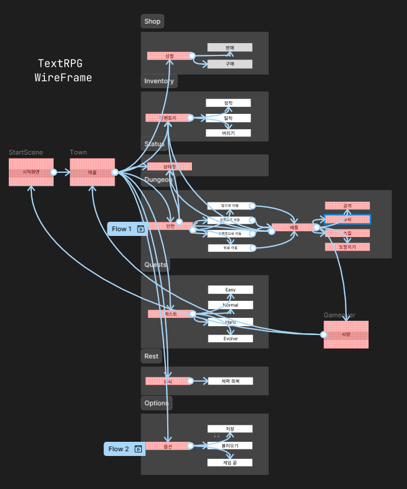

# 🏰 TextRPG - DUN 소개

### 1.  텍스트 중심 던전형 게임

- 던전을 탐색하고 점점 더 강해지는 경험을 느낄 수 있다.
- 텍스트로 진행하는 방식이라서 지루할 수 있을

### 2. 퀘스트와 아이템

- DUN만의 맞춤형 아이템과 퀘스트를 통한 즐거움 제공

### 3. 쉽고 직관적인 UI

- 텍스트와 Ascii Art로 인한 직관적인 인터페이스 제공.

# 🖼️ WireFrame

Dun의 WireFrame 설계

https://www.figma.com/design/GP9zVKt0nwOz0Bjb08yUHn/%EB%8D%98-Dun.-?node-id=0-1&p=f&t=erZqcIzz3qwJQRrZ-0

# 🔧 주요 기능 및 특징

### 1. 캐릭터 생성

- 다양한 직업을 선택할 수 있습니다
- 각 직업마다 고유한 스킬을 활용하여 특색 있는 캐릭터를 만들 수 있습니다

### 2. 던전

- 플레이어의 선택에 따라 경로가 동적으로 변화합니다
- 각 선택지마다 다른 확률로 몬스터와 마주칩니다
- 몬스터 처치 목표를 달성하면 던전의 난이도가 올라갑니다

### 3. 전투

- 전투를 하기 전 몇 마리의 고블린을 만났는지 텍스트로 출력을 함과 동시에 각 몬스터의 종류에 따라 알맞은 아스키 아트를 출력합니다.
- 플레이어는 전투 중 일반 공격, 스킬 공격이 가능하며 회피와 치명타 판정은 자동으로 처리됩니다.
- 전투 중에 인벤토리와 스탯 관리 창에 접근 가능합니다.
- 전투 중 자유롭게 전투에서 벗어날 수 있습니다.
- 몬스터를 죽였을 때 주요 보상으로 경험치와 골드를 획득할 수 있으며 추가적으로 랜덤 확률로 아이템을 획득할 수 있습니다.

### 4. 스킬

- 스킬의 종류에는 몬스터를 공격하는 액티브 스킬과 캐릭터의 스탯을 증가시키는 버프 스킬로 두 종류가 존재합니다.
- 액티브 스킬은 캐릭터의 공격력을 베이스로 각 스킬마다 가중치가 존재하여 더 큰 데미지로 몬스터를 공격할 수 있습니다.
- 버프 스킬은 몬스터를 공격하진 않지만

### 5. 인벤토리 관리

- 인벤토리 창은 마을, 던전에 있을 때 열람이 가능하고 전투 중에서도 열람이 가능합니다.
- 인벤토리 창에서 플레이어는 아이템을 착용, 탈착이 가능하며 버리는 것도 가능합니다.

### 6. 상점

- 플레이어는 상점에서 아이템을 사고 팔 수 있습니다.
- 살 수 있는 아이템은 주로 방어구, 무기, 그리고 포션 입니다. 퀘스트 아이템은 구매가 불가능합니다.
- 팔 수 있는 아이템은 방어구, 무기, 그리고 포션과 같은 아이템과 퀘스트 아이템입니다.

### 7. 휴식

- 플레이어는 마을에서 휴식을 취해 체력과 MP를 회복할 수 있습니다.
- 플레이어는 휴식 기능에서 방 옵션을 선택하여 체력과 MP의 회복 정도를 결정할 수 있습니다.

### 8. 퀘스트

- 플레이어에게 다양한 퀘스트를 제공합니다.
- 플레이어는 수주할 수 있는 퀘스트, 수주한 퀘스트, 완료 가능한 퀘스트, 완료한 퀘스트 별로 정리된 리스트를 볼 수 있습니다.
- 플레이어는 퀘스트를 수주하기 전에 퀘스트 완료를 위해 필요한 아이템을 가지고 있다면 그 퀘스트를 수주할 시 진행도가 자동으로 갱신됩니다.
- 플레이어는 퀘스트를 완료하기 위해 마을에 있는 퀘스트 수주 장소에서 Quest 완료를 선택하면 보상을 받을 수 있습니다.
- 보상은 경험치와 골드가 제공됩니다.

### 9. 상태 창

- 캐릭터의 전체적인 정보와 스탯을 볼 수 있습니다.
- 캐릭터가 현재 장비하고 있는 방어구와 무기를 볼 수 있습니다.
- 또한 보유 스킬도 볼 수 있습니다.

### 10. 저장 & 불러오기

- 캐릭터, 진행한 퀘스트, 게임 정보를 저장하고 불러올 수 있습니다.
- 저장 및 불러오기는 항상 마을에서만 가능합니다.

# 📽️ 시연 영상